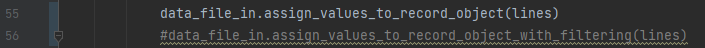
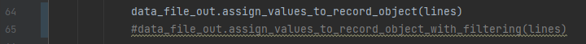

###Description:
script gathers the statistics about training effectiveness in file called the same as relevant file, but with .statistics annotation.

###Parameters:
- as parameter there should be given a path to directory with data, which was an input for training e.g. C:\Users\rsolecka\Rozalia\inzynierka\VideoExtractionServer\data\annotations.
There should exist the directory with .txt files after training. It should be called analogously e.g. C:\Users\rsolecka\Rozalia\inzynierka\VideoExtractionServer\data\annotations.lego.
The change from annotation to annotation.lego is set in the source code.
- second parameter is optionally IoU threshold for correctly detected object this should be set as a number in 0-1 range with default value of 0.5.

###.statistics.txt file contains sequentially:
- number of objects
- number of recognised objects
- number of correctly recognised objects based on relative error of measurement and static value

###Excel workbook:
- apart from global statistic, statistics for specific directory (for specific kinds of bricks) are provided and are saved to xlsx file named Statistics.xlsx. Class xlsx_file.py gathers these statistics.
- number_of_files variable store the number of all .txt files

###Charts:
- chart.py class creates charts with statistics for detections effectiveness

###Filtering:
- commenting/uncommenting relevant line in training_effectiveness.py makes it possible to turn on/off filtering records(objects) which are on the edge of the photos

###Used data: 
https://mostwiedzy.pl/en/open-research-data/tagged-images-with-lego-bricks-part-2,202106211201371071141-0